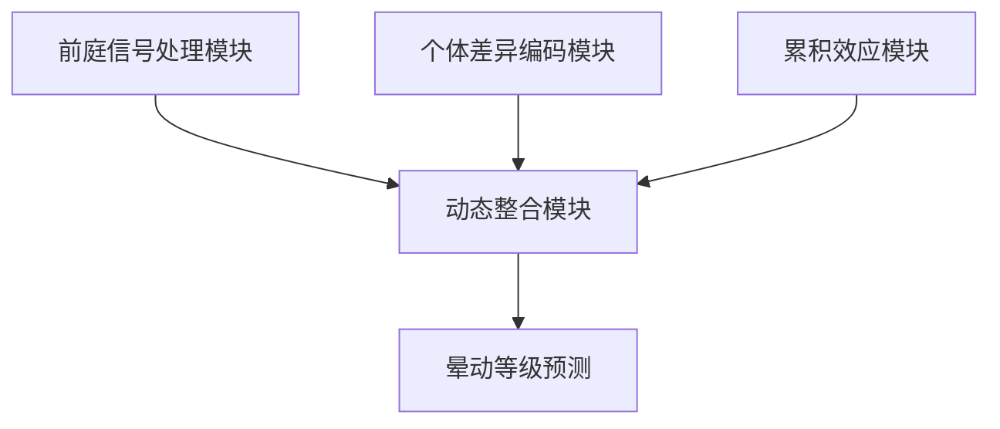

特征值：
- MS_t_car$$
\left( \frac{1}{\sqrt{ t }}\left( \int_{0}^t a_{w}^2dt \right) \right)^{1/2}
$$
- MSDV_dummy
- 进食时间（吃饭距离做实验的时间，大致）
- 睡眠时长
- 位置（RL，RM，FR）
## 端到端方案

```mermaid
graph TD
    A[前庭信号处理模块] --> D[动态整合模块]
    B[个体差异编码模块] --> D
    C[累积效应模块] --> D
    D --> E[晕动等级预测]
```
